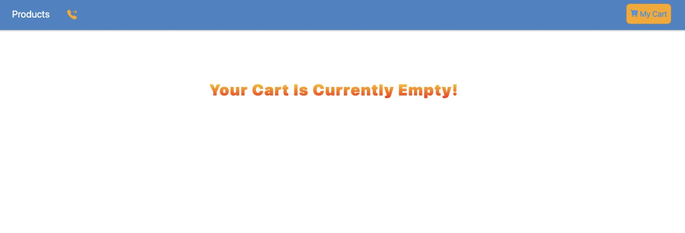

# Phone-Store

## Description:

This is a e-commerce phone store shopping website that users can look through the different types of phones
in the home page, and check the phone details like phone's name, category, price in the detail page; the phones can be
added into cart page by open modal's cart or click the 'add to cart' button in the detail page.
It will show users the subtotal, tax and total amount of his or her cart.
\
 
\

## Table of Contents

1. [Technical Features](#tech)
   - [how to start?](#start)
2. [User Guidelines](#user)

   - [Home page](#home)
   - [Home-cart part](#homecart)
   - [Home-incart part](#incart)
   - [Modal part](#modal)
   - [Detail page](#detail)
   - [Cart page](#cart)
   - [Empty cart part](#empty)
   - [Contact page](#contact)
   - [Error page](#error)

3. [What did I learn?](#learn)
   - [Lessons Learned](#lessons)
4. [Future Work](#future)

## Technical Features 

#### how to start? 

- This project was created by 'Create React App' script.

- To run the app in development mode, you can run from project directory:

`npm start`

- Runs the app in the development mode.Open http://localhost:3000 to view it in your browser.
- The page will reload when you make changes.\

## User Guidelines 

#### Home page 

- Users can view all phones in the website.
- Other status will be hidden if users have not done anything about the web just viewed it.

#### Home-cart part 

- When users move into the phone image part, it will show 'cart' image to users
- Users can click the 'cart' image, it will open 'modal' part immediately.

#### Modal part 

- The modal part always stay in the center of the website.
- It will show users the product in detail and enable users to add the phone to cart by clicking 'go to cart' button
  or go back to home page by clicking 'back' button if the users change mind.

#### Home-incart part 

- If users added the phone to cart, the cart part will not show 'cart' image
  instead of 'InCart' words, which can let users know this product has already
  in cart now.

#### Detail page

- When users click any image of phones, it will transfer to detail page soon,
  the phone's name, price, category and description will show in detail page.
- Also, users can add the phone to cart by clicking 'add to cart' button or go
  back to home page by clicking 'back to product' button.

#### Cart page

- In cart page, it show users which product has already be added in cart now, and display
  subtotal, tax and total amount they need to pay.
- If users would like to change the number of phones which already stay in cart page now, they can click
  the symbols of '-' and '+' to decrease or increase the number of phones.
- If users would like to remove this phone, they can click the 'remove' button to delete that one.
- If users would like to delete all products that already in cart now, they can click 'clear cart' button in the
  bottom to remove all of the products to make the cart empty.

#### Empty cart part

- When the cart is empty or users have not added any phone to cart, it will
  show users 'the cart is empty'.

#### Contact page

- When users would like to contact with us, they can click the 'phone call' image in the header part
  it will go to contact us page so users can input their email or messages to us.

#### Error page

- If users make a mistake to enter a wrong web link, it will show users '404' page.
- From the error 404 page, users can go to home page by clicking 'go back home' button.

## What did I learn?

#### Delopyment

- I use this section to deploy live pages in Github: [https://facebook.github.io/create-react-app/docs/deployment](https://facebook.github.io/create-react-app/docs/deployment)

- I also use [Netlify](https://www.netlify.com/?utm_source=google&utm_medium=paid_search&utm_campaign=12755510784&adgroup=118788138897&utm_term=netlify&utm_content=kwd-371509120223&creative=514583565825&device=c&matchtype=e&location=9071326&gclid=Cj0KCQjwg_iTBhDrARIsAD3Ib5j3qovL2scHdTLIhKf6BPgQfvjSfufkbBwjZOTySxzgjB4NOpgngKIaArspEALw_wcB) to deploy live pages using Github repo's existing project.

- When I met deploy errors, I followed this video to correct my error. Finally, I deployed my live page successfully after following the author's advice.[CI= yarn run build]

- [PedroTech](https://www.youtube.com/watch?v=8KGLOJHqNMg)
  In his video, he show us how to deploy a react js application to Netlify. It is very easy to do this, and it allows continuous deployment through github!

#### Code Splitting

- I learned how to split code into different folders to get best practice.
  This section has moved here: [https://facebook.github.io/create-react-app/docs/code-splitting](https://facebook.github.io/create-react-app/docs/code-splitting)

#### npm run build

- I use 'npm run build' to bundles React in production mode, which can optimize the build to get the best performance.
  Builds the app for production to the `build` folder.
  The build is minified and the filenames include the hashes.
  After build, the app is ready to be deployed!
  See the section about [deployment](https://facebook.github.io/create-react-app/docs/deployment) for more information.

#### create-react-app

- I learned how to use 'create-react-app' to build small projects, and how to install node-modules before start the project.

#### How to transfer state between parents and children

- I use this phone store project to practice my 'hooks' and 'redux' skills
- I use **hooks** without 'redux' to finished this project such as 'useReducer', 'useEffect','useContext'.
- Also, I created a new git branch named 'redux', and use **redux** such as 'mapStateToProps', 'mapDispatchToProps' to get global
  states and methods, then passing them to components which needed to use those global states.
- I use '**Sematic UI**' to render the format of detail page.
- I use '**Ant design**' grid to render the cart page.
- I use 'styled-components' to render CSS style.

## Improvements 

- will add some **react-icons** and use some UI libraries such as Ant Design or Material UI to render the style.
- will import **google-fonts** to create different word format.
- will write test code using **'JEST'** for this project.
- I know it will mess the CSS projects if there are different UI libraries used in one project, maybe they will affect each other's style
  so in next project, I decide to use just one UI package.
- I will encapsulate the 'button' component, as I found there are more than one place need to use 'button', so I decide to encapsulate one 'button'
  component, which can make code easily and conveniently. For example, detail page can import 'button' component, and no necessary to write its button style at all.
- I will make my project more responsive in different size of devices.

`npm test`

- Launches the test runner in the interactive watch mode.
  See the section about [running tests](https://facebook.github.io/create-react-app/docs/running-tests) for more information.

`Learn More`

- You can learn more in the [Create React App documentation](https://facebook.github.io/create-react-app/docs/getting-started).
